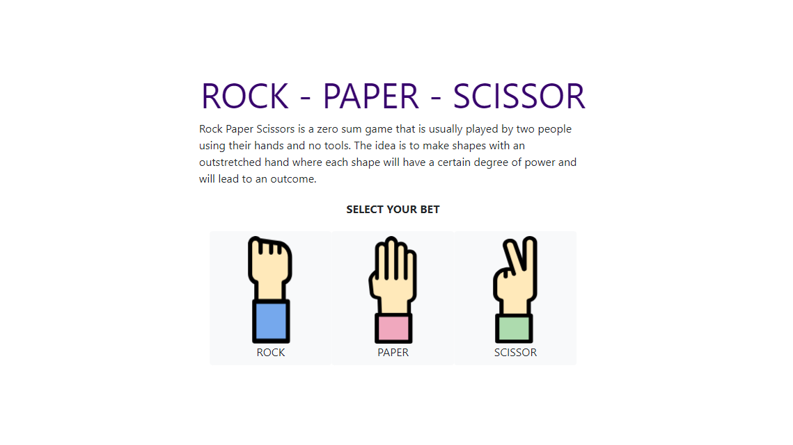
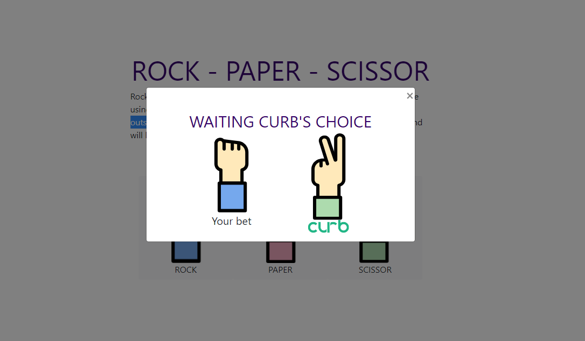
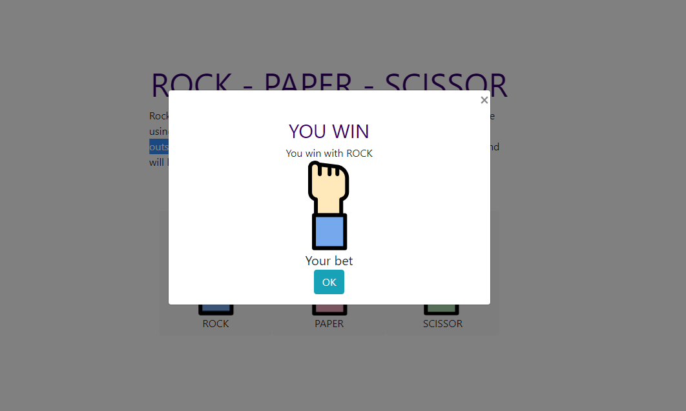

# Curb RPS Exercise

Create a web-based application that allows a user to play rock-paper-scissors.

The app is created for Curb coding exercise. 


## Built With
 * Python - programming language
 * Flask - light-weight web framework 
 * JS  
 * CSS 
 * HTML
## Installation and Setup
#### 1. Install Python3
#### 2. create virtual environment in root directory of project
```
$ python3 -m venv venv
```
#### 3. activate venv

Linux:
```
$ source venv/bin/activate
```
Windows:
```
$ venv\Scripts\activate
```
#### 4. Install flask

```
(venv)$ pip install flask
```

#### 5. Set environmental variables to run the app

Linux
```
(venv)$ export FLASK_APP=manage.py
```
Windows
```
(venv)$ set FLASK_APP=manage.py
```

#### 6. run app
```
(venv)$ flask run
```

#### 7. use browser to access the web application
```
localhost:5000
```
## Usage / How to Play
* Choose from the Rock, Paper, or Scissor by clicking on the corresponding 
button. 

* Wait until data is retrieved from the opponent

* Examine the result. Click on "OK", or the "X" button to start another game.



Note:
For better user experience, the game deliberately hold the 
screen for 1 second after user have chosen a throw even if 
the opponents throw is retrieved immediately. The game also 
holds for 1 second after opponents throw is retrieved, so that
the user can compare the two throws before viewing the result page.